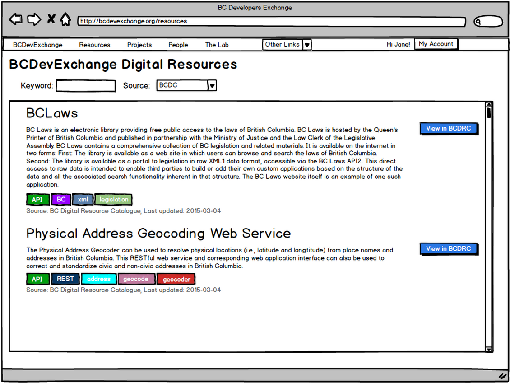

---
[Back to Discussion Index](../discussion_index.md)

##Resources

**Release 1:** BCDevExchange will host an exchange allowing users to post Resources visible to other users. Resources are intended to reflect actual things, usually digital resources, such as code, APIs, applications, and datasets. We are hoping to create a search function on BCDevExchange that looks at both a) GitHub repos and b) registered catalogues, and display things identified as resources (see below Future State 2 and 3). Intention is to delay any implementation of a database / significant back end with stored data on BCDevExchange, and instead rely on external data, functions, and services.
  
**Future State:** All Resources are owned by either an Individual profile (when created or registered in the context of an Individual profile) or an Organization (when created or registered in the context of an Organization specific profile). 

It’s proposed that Resources can be added to the Exchange in several different ways – 

**1 The ‘Fat Finger’ method:** manually typing a Resource into BCDevExchange. 

**2 Registering a catalogue:** providing the details and access information for a compatible catalogue, which exposes an API that can be called by BCDevExchange to harvest its contents in a real time manner. 

**3 Registering a GitHub repo:** providing the details and location of a repo or file within GitHub containing Resources or their details, which can then be harvested by BCDevExchange. This could also be done through adding a template, file, or other identifier to a repo in GitHub, flagging that repo in a unique way (such as /#BCDevExchange) which is used by BCDevExchange to identify and scrape the data in response to a search. Not sure if a Repo would be one Resource, or would contain a list of resources. 

A Resource is identified via a title, description, and possibly multiple metadata tags (which may include things like applicable licenses). Depending on the manner in which the Resource was added to BCDevExchange, the Resource may be updatable through the BCDevExchange functionality, or by modifying the source location (catalogue or GitHub repo readme.md). 

BCDevExchange search functionality will allow users to search on and filter Resources by a variety of search parameters. After searching for a Resource, users are able to select and view the details of a Resource, including linked content and sources, as well as other Resources similar to the selected Resource (based on similar metadata tags and users having followed it). Users may flag a Resource to follow it, in the context of their current profile, and receive notifications regarding changes to that Resource. 

###Resource Metadata (Tags)

**Release 1:** Depending on the source of the resource being displayed in BCDevExchange, it may be possible to filter, retrieve, and display tags already associated with the resource. For example, BCDC already has a concept of keywords that seems functionality equivalent to tags, while GitHub does not have a clear parallel (though it could be facilitated through storing resources in a structured document, text appended to the Readme.md, badges, or something like that).  

**Future State:** As BCDevExchange does not have control over how users may create and define Resources, it is possible that the Resources being defined are defined at very different levels of granularity or using various terms or descriptions. To accommodate a wide range of definitions and descriptors, Resources will be described using metadata tags. When describing a resource, users can type in whatever value they want as a tag, with the interface prompting the user with existing metadata tags that are similar to existing metadata tags.

###Mockup

